# 🇸🇦 الوثيقة الشاملة للمشروع وسيناريو الإلقاء الاستثماري (Master Pitch Deck & Executive Blueprint)

**اسم المنصة:** «نَبيهْ» (NABEEH / Nabeeh.ai)  
**التموضع الاستراتيجي:** المنصة الوطنية للوكلاء الأذكياء والتفاعل الرقمي الفوري (Saudi Sovereign AI Platform)  
**الفئات المستهدفة:** الوزارات والجهات الحكومية، الجامعات، الشركات الكبرى والبنوك، ومتاجر التجارة الإلكترونية في المملكة العربية السعودية  
**التاريخ:** 2026

---

## الفهرس العام للوثيقة

1. [الملخص التنفيذي ورؤية المنصة](#1-الملخص-التنفيذي-ورؤية-المنصة)
2. [المشكلة والفجوة الرقمية في السوق السعودي](#2-المشكلة-والفجوة-الرقمية-في-السوق-السعودي)
3. [الحل والمزايا التنافسية الحصرية](#3-الحل-والمزايا-التنافسية-الحصرية)
4. [الهندسة المعمارية وآلية العمل التقنية](#4-الهندسة-المعمارية-وآلية-العمل-التقنية)
5. [تطبيقات المنصة عبر القطاعات الوطنية الأربعة](#5-تطبيقات-المنصة-عبر-القطاعات-الوطنية-الأربعة)
6. [السيناريو الكامل لإلقاء العرض الاستثماري (شريحة بشريحة دقيقة بدقيقة)](#6-السيناريو-الكامل-لإلقاء-العرض-الاستثماري-شريحة-بشريحة)
7. [نموذج العمل وهيكل الإيرادات (B2G / B2B SaaS)](#7-نموذج-العمل-وهيكل-الإيرادات)
8. [استراتيجية الانتشار والوصول للسوق (Go-To-Market)](#8-استراتيجية-الانتشار-والوصول-للسوق)
9. [التوقعات المالية لـ 3 سنوات والطلب الاستثماري (The Ask)](#9-التوقعات-المالية-والطلب-الاستثماري)
10. [دليل إجابات الأسئلة الصعبة للمستثمرين (Investor Q&A Defense)](#10-دليل-إجابات-الأسئلة-الصعبة-للمستثمرين)

---

## 1. الملخص التنفيذي ورؤية المنصة

### ما هي منصة «نَبيهْ»؟
منصة «نَبيهْ» هي **نظام ذكاء اصطناعي سيادي متكامل (SaaS & Enterprise AI Engine)** يُمكّن أي جهة حكومية، جامعة، شركة كبرى، أو متجر إلكتروني في المملكة العربية السعودية من تحويل بوابتها الرقمية من موقع تقليدي صامت يعتمد على البحث اليدوي بين آلاف الصفحات واللوائح إلى **تجربة تفاعلية حية يقودها وكيل ذكاء اصطناعي فائق التخصيص** بـ **سطر برمجي واحد** (`<script src="...">`).

### الرؤية والرسالة:
* **الرؤية:** بناء العقل الرقمي الذكي والموحد لكافة البوابات والخدمات في المملكة العربية السعودية بما يقود التحول الرقمي وفق مستهدفات رؤية 2030.
* **الرسالة:** تمكين المواطن، الطالب، والعميل من الوصول لأي معلومة، خدمة، أو قرار شراء في أجزاء من الثانية من خلال محادثة عربية طبيعية تدرك سياق الشاشة وتحترم السيادة البيانية.

---

## 2. المشكلة والفجوة الرقمية في السوق السعودي

تعاني المنصات الرقمية في المملكة اليوم من 4 تحديات هيكلية تكلف الاقتصاد مئات الملايين سنوياً:

```
                                  ┌────────────────────────────────────────┐
                                  │      فجوة التفاعل الرقمي في المملكة     │
                                  └───────────────────┬────────────────────┘
                                                      │
         ┌─────────────────────────┬──────────────────┴──────────────────┬─────────────────────────┐
         ▼                         ▼                                     ▼                         ▼
 🏛️ تشتت المستفيدين           📞 تكلفة مراكز الاتصال                🤖 غباء البوتات التقليدية      🔒 مخاطر السيادة البيانية
 ضياع المواطن والطالب بين    إنفاق مئات الملايين على كول سنتر     أشجار شجرية جامدة تفشل في فهم    الحلول الأجنبية لا تمتثل
 مئات اللوائح والـ PDFs      يعاني من انتظار طويل في الذروة       اللهجة وصياغة المستفيد السعودي   لنظام حماية البيانات (PDPL)
```

1. **تشتت المستفيد وصعوبة الوصول للخدمة:**
   - البوابات الحكومية والجامعية تحتوي على آلاف اللوائح التنظيمية، شروط التراخيص، وأدلة القبول بصيغ PDF وروابط متفرعة تجعل المستفيد عاجزاً عن استخراج المعلومة الدقيقة.
   - في التجارة الإلكترونية، يغادر **97% من الزوار دون شراء** بسبب الحيرة بين المنتجات أو التردد في فهم المقاسات والتقسيط والشحن.
2. **التكلفة التشغيلية الهائلة لمراكز الاتصال والدعم:**
   - تنفق الجهات الحكومية والجامعات والشركات مبالغ طائلة لتشغيل مراكز اتصال (Call Centers) تعمل بطاقة استيعابية محدودة وتواجه ضغطاً هائلاً وأوقات انتظار طويلة خاصة في مواسم القبول، تجديد التراخيص، والعروض.
3. **فشل الشات بوت القديم (Rule-based Chatbots):**
   - الروبوتات القديمة المبنية على الكلمات المفتاحية والأشجار الجامدة أثبتت فشلها؛ فهي لا تفهم اللهجات السعودية المتنوعة، ولا تملك القدرة على الربط بين النصوص، وتزيد من إحباط المستخدم.
4. **مخاطر الخصوصية وغياب السيادة البيانية:**
   - الأنظمة العالمية (مثل Zendesk أو Intercom) تستضيف بياناتها خارج المملكة وتفتقر للتوافق مع **نظام حماية البيانات الشخصية السعودي (PDPL)**، بالإضافة إلى انعدام القدرة على التحكم الفوري في حظر أو إخفاء البيانات الحساسة عن الذكاء الاصطناعي.

---

## 3. الحل والمزايا التنافسية الحصرية

تقدم منصة «نَبيهْ» البديل السيادي المتكامل الذي يتفوق على الحلول المحلية القديمة والعالمية:

| وجه المقارنة | منصة «نَبيهْ» 🇸🇦 | الشات بوت التقليدي | الحلول العالمية (Intercom / Zendesk) |
| :--- | :---: | :---: | :---: |
| **سرعة الإعداد والربط** | ✅ دقيقة واحدة (سطر كود) | ❌ أسابيع من البرمجة وتصميم الأشجار | ⚠️ إعدادات وتدريب يدوي معقد |
| **الفهم اللغوي والتنظيمي** | ✅ فهم محلي للهجات والأنظمة | ❌ لا يفهم الصياغات الحرة | ⚠️ ترجمة آلية ركيكة لا تفهم الأنظمة |
| **قراءة الشاشة الحية (Live Context)**| ✅ إدراك فوري لمتصفح الزائر | ❌ غير متوفر نهائياً | ❌ غير متوفر في معظم السيناريوهات |
| **السيادة والامتثال لـ PDPL** | ✅ استضافة محلية سيادية كاملة | ❌ تخزين مشتت وضعيف | ❌ خوادم خارج المملكة |
| **التحكم في حظر وإخفاء المعرفة** | ✅ بنقرة زر واحدة فورياً | ❌ غير متوفر | ⚠️ إجراءات تصفية بطيئة |
| **دقة الإجابات ومنع الهلوسة** | ✅ استرجاع RAG دلالي 100% | ❌ إجابات ثابتة محدودة | ⚠️ هلوسة في النصوص العربية المعقدة |

---

## 4. الهندسة المعمارية وآلية العمل التقنية

```mermaid
flowchart LR
    subgraph Ingestion [1. استيعاب المعرفة]
        Web[🌐 زحف البوابة / SPA / React]
        PDF[📄 لوائح وأنظمة PDF / Docs]
        DB[🗄️ قواعد البيانات / الكتالوج الحي]
    end

    subgraph Processing [2. المعالجة والتحكم]
        Chunker[🧩 Semantic Chunking Engine]
        Filter[🛡️ 1-Click Privacy & AI Exclusion]
        VectorDB[⚡ Vector Index & Supabase RAG]
    end

    subgraph Execution [3. محرك الاسترجاع والحوار]
        Screen[👁️ Live DOM Screen Context]
        RAG[🔍 Hybrid Similarity Match]
        LLM[🤖 Sovereign LLM Gateway]
    end

    subgraph Output [4. التفاعل والتوجيه]
        Widget[💬 التفاعل اللحظي والأزرار الموجهة]
    end

    Ingestion --> Processing
    Processing --> Execution
    Execution --> Output
```



### المكونات التقنية الأربعة لمحرك «نَبيهْ»:
1. **محرك الزحف المتصفحي العميق (Headless Multi-Depth Crawler):**
   - يقرأ الموقع أوتوماتيكياً حتى في البوابات المعقدة وتطبيقات الـ SPA المبنية بـ React وNext.js وVue.
2. **محرك التجزئة والتحكم بالخصوصية (Semantic Chunking & Privacy Filter):**
   - يفكك آلاف الصفحات واللوائح إلى مقاطع دلالية، ويوفر للجهة **أول لوحة تحكم فورية لاستبعاد أي صفحة أو مستند من الذكاء بنقرة زر واحدة**.
3. **محرك الاسترجاع الهجين ومنع الهلوسة (Hybrid RAG Engine):**
   - يطابق استفسار المستفيد مع أدق المقاطع في أقل من 0.8 ثانية، ويحقن المعلومة في سياق النموذج (Prompt Context) ليجيب بدقة استناداً للأنظمة الرسمية فقط.
4. **مستشعر الشاشة الحية (Live Screen Awareness):**
   - يقرأ ما يراه المستخدم على الشاشة حالياً (النموذج، السعر، الخطوة التي توقف عندها) ليوجهه فورياً بدون حاجة لإعادة شرح المشكلة.

---

## 5. تطبيقات المنصة عبر القطاعات الوطنية الأربعة

### 1. 🏛️ الوزارات والجهات الحكومية (GovTech):
* **الاستخدام:** شرح لوائح التراخيص، الاشتراطات البلدية، الأنظمة العدلية، والخدمات الضريبية.
* **الأثر:** توجيه المستفيد فورياً لصفحات إتمام الخدمة (أبشر، قوى، بلدي، ناجز، الزكاة والجمارك) وخفض الضغط على مراكز الاتصال بنسبة **تتجاوز 75%**.

### 2. 🎓 الجامعات والمؤسسات الأكاديمية (EdTech):
* **الاستخدام:** إرشاد مئات آلاف الطلاب في مواسم القبول والتسجيل، شرح نسب القبول الموزونة، المسارات التخصصية، لوائح الابتعاث، ومواعيد الحذف والإضافة.
* **الأثر:** توفير مرشد أكاديمي ذكي يعمل على مدار الساعة لخدمة الطلاب الجدد والمبتعثين.

### 3. 🏢 الشركات الكبرى، البنوك والتأمين (Enterprise & FinTech):
* **الاستخدام:** مقارنة برامج التمويل العقاري والشخصي، حساب الأقساط، شرح بنود وثائق التأمين، وتأهيل طلبات المبيعات آلياً.
* **الأثر:** رفع سرعة الاستجابة اللحظية وتحويل الزائر إلى عميل مؤهل بأعلى كفاءة.

### 4. 🛍️ التجارة الإلكترونية والشركات المتوسطة (E-Commerce & Retail):
* **الاستخدام:** الربط المباشر مع متاجر سلة، زد، وشوبيفاي، الإجابة عن مواصفات المنتجات، المقاسات، سياسات الشحن، وخيارات التقسيط (تمارا وتابي).
* **الأثر:** مضاعفة معدل التحويل البيعي وخفض معدل السلات المتروكة.

---

## 6. السيناريو الكامل لإلقاء العرض الاستثماري (شريحة بشريحة)

> [!TIP]
> هذا السيناريو مصمم للإلقاء في مدة تتراوح بين **7 إلى 10 دقائق** أمام لجان الاستثمار وصناديق رأس المال الجريء (VCs) والمستثمرين الملائكيين في السعودية.

---

### الشريحة 1: الغلاف والرؤية (المدة: 30 ثانية)
* **المعروض على الشاشة:** عنوان العرض: «المنصة الوطنية للوكلاء الأذكياء — نَبيهْ» مع هوية رؤية 2030 والقطاعات المستهدفة.
* **ما تقوله للمستثمرين:**
  > "بسم الله الرحمن الرحيم، مساكم الله بالخير جميعاً.  
  > تخيلوا معي لو أن كل مواطن، طالب، أو مشتري يدخل على أي موقع حكومي، جامعة، أو متجر في المملكة، يجد مساعداً سعودياً نبيهاً، يفهم عليه فوراً، يقرأ شاشته، ويقوده لإنهاء معاملته في ثوانٍ بدلاً من الضياع في مئات اللوائح والروابط.  
  > يسعدني أن أقدم لكم اليوم منصة **«نَبيهْ»** — المنصة الوطنية للوكلاء الأذكياء والتفاعل الرقمي الفوري."

---

### الشريحة 2: المشكلة الوطنية (المدة: 60 ثانية)
* **المعروض على الشاشة:** فجوة التفاعل الرقمي (تشتت المستفيدين، تكلفة الكول سنتر، غباء البوتات القديمة، وتحديات السيادة).
* **ما تقوله للمستثمرين:**
  > "المشكلة التي نحلها اليوم تلمس كل واحد منا:  
  > **أولاً:** أكثر من 97% من زوار المواقع والمتاجر يغادرون دون إتمام هدفهم بسبب صعوبة العثور على المعلومة الدقيقة في ملفات الـ PDF والأنظمة المعقدة.  
  > **ثانياً:** الجهات الحكومية والجامعات والشركات تنفق مئات الملايين سنوياً على مراكز اتصال تعاني من تكدس المكالمات وبطء الرد.  
  > **ثالثاً:** الشات بوت التقليدي المبني على أزرار وخيارات شجرية عقيمة أثبت فشله التام في خدمة المستفيد السعودي.  
  > **وأخيراً:** الحلول العالمية غير متوافقة مع نظام حماية البيانات الشخصية السعودي (PDPL) وتفتقر للسيادة البيانية."

---

### الشريحة 3: الحل — وكيل ذكاء اصطناعي سيادي (المدة: 60 ثانية)
* **المعروض على الشاشة:** الأعمدة الأربعة لمنصة «نَبيهْ» (التعلّم الفوري، الفهم المحلي، قراءة الشاشة الحية، والتحكم السيادي).
* **ما تقوله للمستثمرين:**
  > "الحل الذي بنيناه في منصة **«نَبيهْ»** هو وكيل ذكاء اصطناعي يندمج في أي منصة بـ **سطر برمجي واحد**:  
  > • **يتعلّم ذاتياً في دقائق:** يقرأ البوابة واللوائح والمستندات أوتوماتيكياً.  
  > • **يفهم اللهجة والسياق التنظيمي:** يتحدث بلغة سعودية طبيعية ويفهم المصطلحات الرسمية والأكاديمية.  
  > • **يقرأ الشاشة الحية:** يفهم الصفحة والنموذج الذي يقف عليه المستخدم حالياً ويرشده لحظياً.  
  > • **تحكم سيادي كامل:** بضغطة زر واحدة، يستطيع المسؤول حظر أو استبعاد أي معلومة حساسة من الذكاء."

---

### الشريحة 4: التطبيقات والقطاعات الوطنية المستهدفة (المدة: 45 ثانية)
* **المعروض على الشاشة:** القطاعات الأربعة (الوزارات، الجامعات، الشركات الكبرى، والتجارة الإلكترونية).
* **ما تقوله للمستثمرين:**
  > "«نَبيهْ» ليس شات بوت لمتجر فقط، بل هو محرك وطني شامل:  
  > في **الوزارات** يوجه المستفيد فورياً لخدمات أبشر وبلدي وناجز.  
  > في **الجامعات** يجيب عن شروط القبول والخطط الدراسية لآلاف الطلاب 24/7.  
  > في **البنوك والشركات** يشرح برامج التمويل ويؤهل طلبات المبيعات.  
  > وفي **المتاجر** يرفع معدل التحويل البيعي بنسبة تزيد عن 30%."

---

### الشريحة 5: الهندسة التقنية العميقة (المدة: 45 ثانية)
* **المعروض على الشاشة:** مخطط محرك RAG الهجين، والزحف المتصفحي، وبوابة النماذج السيادية.
* **ما تقوله للمستثمرين:**
  > "تقنياً، بنينا محرك استرجاع هجين (Hybrid RAG Engine) متطور جداً:  
  > المحرك يقرأ صفحات الـ SPA المعقدة وملفات الـ PDF، يفككها إلى مقاطع دلالية، ويسترجع الإجابة المطابقة في أقل من 0.8 ثانية بدون أي هلوسة وبدقة 100% مستندة إلى وثائق الجهة فقط، مع جاهزية تامة للاستضافة السحابية المحلية السيادية."

---

### الشريحة 6: المقارنة التنافسية (المدة: 45 ثانية)
* **المعروض على الشاشة:** جدول المقارنة مع البوتات التقليدية والحلول الأجنبية (Intercom / Zendesk).
* **ما تقوله للمستثمرين:**
  > "لماذا نكسب أمام أي منافس محلي أو دولي؟  
  > لأننا ندمج أربع ركائز لا تجتمع في حل واحد: سرعة التشغيل في دقائق، الفهم الحقيقي للهجة والأنظمة السعودية، قراءة الشاشة الحية للمستخدم، والامتثال الكامل لـ PDPL بأسعار محلية منافسة."

---

### الشريحة 7: حجم السوق ومواءمة رؤية 2030 (المدة: 45 ثانية)
* **المعروض على الشاشة:** سوق الـ IT في المملكة (+130 مليار)، 100 ألف جهة مؤهلة، ومستهدفات قياس نضج التجربة الرقمية.
* **ما تقوله للمستثمرين:**
  > "سوق تقنية المعلومات والذكاء الاصطناعي في المملكة يتجاوز 130 مليار ريال، وهو الأضخم إقليمياً.  
  > لدينا أكثر من 100,000 جهة حكومية، جامعة، مؤسسة، ومتجر نشط مؤهل للتكامل معنا فوراً. حلنا يرفع تصنيف المملكة في مؤشرات الأمم المتحدة للحكومة الإلكترونية ويدعم مستهدفات قياس لنضج التجربة الرقمية."

---

### الشريحة 8: نموذج العمل والإيرادات (المدة: 45 ثانية)
* **المعروض على الشاشة:** باقات B2G السنوية، باقات Enterprise، وباقات الـ SaaS للمتاجر.
* **ما تقوله للمستثمرين:**
  > "نموذج أعمالنا يعتمد على الاشتراكات السحابية المتكررة (B2B/B2G SaaS):  
  > • **عقود سنوية وتراخيص مؤسسية (B2G SLA)** للوزارات والجامعات.  
  > • **اشتراكات الشركات والبنوك** ابتداءً من 3,500 ريال شهرياً.  
  > • **اشتراكات مرنة للمتاجر والشركات المتوسطة** من 199 إلى 999 ريال شهرياً."

---

### الشريحة 9: استراتيجية التوسع والانتشار (المدة: 45 ثانية)
* **المعروض على الشاشة:** الشراكات الحكومية (DGA، سدايا)، المبادرات الجامعية، متاجر سلة وزد، والتوسع الخليجي.
* **ما تقوله للمستثمرين:**
  > "خطة انتشارنا ترتكز على شراكات استراتيجية موثوقة:  
  > التكامل مع منظومة التحول الرقمي الوطنية وسدايا، إطلاق مبادرات تجريبية في كبرى الجامعات، وإتاحة التطبيق بنقرة واحدة في متاجر تطبيقات سلة وزد لأكثر من 50,000 تاجر، ثم الانطلاق نحو أسواق الخليج."

---

### الشريحة 10: التوقعات المالية لـ 3 سنوات (المدة: 45 ثانية)
* **المعروض على الشاشة:** السنة 1 (4.5M ر.س) ← السنة 2 (14.8M ر.س) ← السنة 3 (38.0M ر.س ARR).
* **ما تقوله للمستثمرين:**
  > "مستهدفاتنا المالية واضحة وواقعية:  
  > في السنة الأولى نستهدف 4.5 مليون ريال كإيراد سنوي متكرر (ARR) عبر 20 جهة كبرى و500 متجر، لنصل في السنة الثالثة إلى 38 مليون ريال مع الربحية التامة والريادة الإقليمية."

---

### الشريحة 11: الطلب الاستثماري واستخدام الأموال (المدة: 45 ثانية)
* **المعروض على الشاشة:** جولة بذرة (Seed Round) بقيمة 5,000,000 ريال وتوزيع رأس المال.
* **ما تقوله للمستثمرين:**
  > "لتحقيق هذه الرؤية، نفتح اليوم جولة استثمارية بذرة (Seed Round) بقيمة **5 مليون ريال سعودي**.  
  > ستُخصص 40% للمبيعات والشراكات الحكومية والمؤسسية، 35% للبحث وتطوير النماذج السيادية والوكلاء الصوتيين، و25% للبنية التحتية والامتثال القانوني."

---

### الشريحة 12: الخاتمة والدعوة للاستثمار (المدة: 30 ثانية)
* **المعروض على الشاشة:** شعار «نَبيهْ» وبيانات التواصل وروابط التجربة الحية.
* **ما تقوله للمستثمرين:**
  > "نحن لا نبني مجرد أداة محادثة، نحن نبني **العقل الرقمي الذكي لكل بوابة ومؤسسة في المملكة**.  
  > ندعوكم لتكونوا شركاءنا في قيادة هذا التحول الوطني.  
  > شكراً لكم، ويسعدنا الإجابة على استفساراتكم وتجربة النسخة الحية معاً."

---

## 7. نموذج العمل وهيكل الإيرادات (B2G / B2B SaaS)

| الفئة المستهدفة | طبيعة العقد | متوسط التسعير المتوقع | الميزات المشمولة |
| :--- | :--- | :--- | :--- |
| **🏛️ الوزارات والجهات الحكومية** | ترخيص سنوي مؤسسي (Enterprise B2G) | 150,000 - 500,000+ ر.س / سنوياً | استضافة سيادية محلية، زحف غير محدود، تكامل مع قواعد البيانات، اتفاقية مستوى الخدمة (SLA) مخصصة |
| **🎓 الجامعات والمؤسسات الأكاديمية** | ترخيص سنوي (EdTech License) | 80,000 - 250,000 ر.س / سنوياً | دعم شامل لبوابات القبول والعمادات، تغذية من آلاف لوائح الابتعاث والمقررات |
| **🏢 الشركات الكبرى والبنوك** | اشتراك سنوي (Enterprise B2B) | 3,500 - 15,000 ر.س / شهرياً | ربط كتالوجات الخدمات الحية، تحليلات متقدمة، تخصيص الهوية والنبرة الصوتية |
| **🛍️ المتاجر والشركات المتوسطة** | اشتراك SaaS ذاتي الخدمة | 199 - 999 ر.س / شهرياً | تثبيت بنقرة واحدة لسلة وزد، زحف للمنتجات، تحسين التحويل البيعي |

---

## 8. استراتيجية الانتشار والوصول للسوق (Go-To-Market)

```
                            [ المرحلة 1: التأسيس والاعتماد الوطني ]
                                           │
       ┌───────────────────────────────────┼───────────────────────────────────┐
       ▼                                   ▼                                   ▼
 اعتماد هيئة الحكومة الرقمية (DGA)      مبادرات تجريبية مع جامعتين سعوديتين       تطبيق موثق في سلة وزد
 وسدايا والامتثال لـ PDPL              (جامعة الملك سعود / البترول)              لـ 50,000+ متجر محلي
                                           │
                            [ المرحلة 2: التوسع المؤسسي B2B ]
       التكامل مع شركات تكامل الأنظمة (System Integrators مثل تحكم، علم، STC Solutions)
                                           │
                            [ المرحلة 3: التوسع الإقليمي في الخليج ]
       الانطلاق من الرياض نحو أسواق الإمارات، قطر، والكويت
```

---

## 9. التوقعات المالية والطلب الاستثماري

### التوقعات المالية لخطة 3 سنوات (Financial Forecast):

| المؤشر المالي | السنة الأولى (Year 1) | السنة الثانية (Year 2) | السنة الثالثة (Year 3) |
| :--- | :---: | :---: | :---: |
| **الإيراد السنوي المتكرر (ARR)** | 4.5 مليون ر.س | 14.8 مليون ر.س | 38.0 مليون ر.س |
| **الجهات الحكومية والجامعات** | 20 جهة | 60 جهة | 150 جهة |
| **المتاجر والشركات المشتركة** | 500 عميل | 2,000 عميل | 6,000 عميل |
| **المحادثات المعالجة شهرياً** | 10 مليون محادثة | 45 مليون محادثة | 150 مليون محادثة |
| **هامش الربح الإجمالي (Gross Margin)**| 78% | 83% | 87% |

### تفاصيل الجولة الاستثمارية (Seed Ask: 5,000,000 SAR):
* **40% (2,000,000 ر.س):** المبيعات، التسويق الحكومي والمؤسسي، وبناء شبكة شراكات التحول الرقمي.
* **35% (1,750,000 ر.س):** البحث والتطوير (R&D)، تدريب نماذج لغوية سيادية، وتطوير الوكلاء الصوتيين التفاعليين (Voice AI).
* **15% (750,000 ر.س):** البنية التحتية السحابية المحلية، شهادات الأمن السيبراني (NCA ECC/CCC)، والامتثال لـ PDPL.
* **10% (500,000 ر.س):** العمليات القانونية، التراخيص، وتسجيل الملكية الفكرية.

---

## 10. دليل إجابات الأسئلة الصعبة للمستثمرين (Investor Q&A Defense)

### س1: ما الذي يمنع العميل من استخدام ChatGPT أو بناء بوت خاص بـ OpenAI؟
**الإجابة النموذجية:**  
> "ChatGPT أداة عامة وليست وكيلاً مدمجاً في البوابات. لبناء حل مشابه، تحتاج الجهة إلى فريق من مهندسي الذكاء الاصطناعي، وبناء محرك زحف للـ SPAs، وتقطيع المستندات، وإدارة محرك RAG معقد، وربطه بشاشة المستخدم الحية، والتوافق مع نظام PDPL. نحن نمنحهم كل هذه المنظومة المتكاملة جاهزة ومختبرة وتعمل خلال 60 ثانية وبأعلى معايير الأمان."

### س2: كيف تضمنون عدم هلوسة الذكاء الاصطناعي عند الإجابة على لوائح رسمية حساسة؟
**الإجابة النموذجية:**  
> "نظامنا يعتمد على تقنية **الاسترجاع الدلالي الصارم (Strict RAG)**؛ حيث يُلزم النموذج بعدم توليد أي إجابة إلا إذا كانت مستندة ومطابقة 100% للمقاطع المسترجعة من لوائح الجهة المفهرسة، مع تزويد المستفيد برابط المرجع الرسمي، بالإضافة إلى ميزة إخفاء واستبعاد أي صفحة غير مرغوبة بنقرة زر."

### س3: كيف تتعاملون مع اشتراطات الأمن السيبراني والسيادة البيانية في السعودية؟
**الإجابة النموذجية:**  
> "منصتنا مصممة منذ اليوم الأول للامتثال لضوابط الهيئة الوطنية للأمن السيبراني (NCA) ونظام حماية البيانات الشخصية (PDPL) الصادر عن سدايا. نوفر خيارات استضافة سحابية سيادية داخل المملكة (عبر STC Cloud أو Oracle Cloud الرياض أو Google Cloud الدمام) مع إمكانية النشر الداخلي الكامل (On-Premise) للجهات ذات الحساسية الأمنية العالية."

### س4: ما هو المانع التنافسي (Moat) الذي يحمي مشروعكم من المنافسين الجدد؟
**الإجابة النموذجية:**  
> "حاجزنا التنافسي مركب من 3 عناصر رئيسية:  
> 1. **البيانات والأداء المحلي:** تفوق محركنا اللغوي في فهم اللهجات والأنظمة واللوائح السعودية.  
> 2. **تقنية الشاشة الحية (Live Screen Awareness):** ميزة حصرية تجعل المساعد يتفاعل مع حركة المستخدم الحالية على الموقع.  
> 3. **تكلفة التبديل والاندماج (Integration Switching Cost):** بمجرد ربط المنصة بقواعد بيانات الجهة وتدريبها على آلاف المستندات، يصبح استبدالها مكلفاً ومعقداً للعميل."

---

## 📄 الملفات والموارد المرتبطة بالمشروع

* 📄 **عرض الـ PDF الجاهز:** [`Saudi_AI_Platform_Pitch_Deck.pdf`](file:///Users/abdullahmohammedahmedabdoalhwyj/Desktop/projects/ai/Saudi_AI_Platform_Pitch_Deck.pdf)
* 📊 **عرض البوربوينت القابل للتعديل:** [`Saudi_AI_Platform_Pitch_Deck.pptx`](file:///Users/abdullahmohammedahmedabdoalhwyj/Desktop/projects/ai/Saudi_AI_Platform_Pitch_Deck.pptx)
* 🌐 **عرض الويب التفاعلي للطباعة:** [`pitch_deck_presentation.html`](file:///Users/abdullahmohammedahmedabdoalhwyj/Desktop/projects/ai/pitch_deck_presentation.html)
* 🎨 **استعراض الشعارات التجريدية:** [`brand_logo_abstract_preview.html`](file:///Users/abdullahmohammedahmedabdoalhwyj/Desktop/projects/ai/brand_logo_abstract_preview.html)
